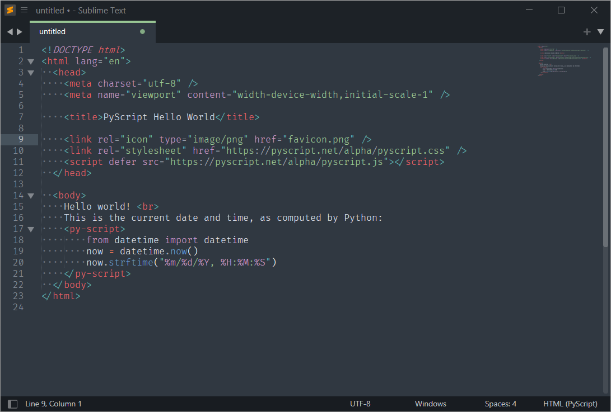

# PyScript

   

A Sublime Text package that offers enhanced syntax highlighting for [PyScript](https://pyscript.net/). Read more for the full documentation.

## Features

- Syntax highlighting for python scripts within the `py-script` tags.

## Installation

#### Package Control
The best way is to install it via [Package Control](https://packagecontrol.io/). Once you have Package Control setup in Sublime Text, open the command palette and search for `Package Control: Install Package`. Search for `PyScript`. There should be a package with the URL as https://github.com/Sublime-Instincts/PyScript. Install it. Package Control will take care for of automatically updating the package for you if there are new releases.

You can also use `Package Control: Add Repository`. Copy the github url (without the `.git` at the end) and enter it into the input panel that pops up at the bottom when you select `Package Control: Add Repository`. Now use `Package Control: Install Package` and search for `PyScript` and install it.

## Documentation

### How to use this package ?

When you install the package, by default none of your PyScript files (which are essentially just HTML files) will have python syntax highlighting. This is because PyScript by default doesn't have a unique file extension. They are just regular HTML files. Hence, follow the instructions given below to get the required highlighting.

Go to the bottom right status bar item that displays information on current syntax and click on that when the currently open file is any `.html` file. From there go to `Open all with current extensions as ...` and scroll to select `HTML (PyScript)`. You should now be good to go. The same thing can be done even via `View -> Syntax` from the main menu.

Techinically, it doesn't matter if you assign `HTML (PyScript)` syntax to your regular HTML files, since it just adds some custom highlighting for `PyScript` specific tags. Normal HTML syntax should still be highlighted correctly.

## Reporting issues.

There is always scope for improvements, so please do report any bug(s) that you encounter.

Please follow the issue template that has been setup while reporting any bug(s) (So as to stay as organised as possible).

## Acknowledgements.

The [syntax_test.yml](https://github.com/Sublime-Instincts/PyScript/blob/master/.github/workflows/syntax_test.yml) is taken & used (with some modifications) from the official [Packages](https://github.com/sublimehq/Packages) repository. So full credit goes to them for it.

## License
The MIT License (MIT)

Copyright 2022-2024 &copy; Ashwin Shenoy

Permission is hereby granted, free of charge, to any person obtaining a copy of this software and associated documentation files (the "Software"), to deal in the Software without restriction, including without limitation the rights to use, copy, modify, merge, publish, distribute, sublicense, and/or sell copies of the Software, and to permit persons to whom the Software is furnished to do so, subject to the following conditions:

The above copyright notice and this permission notice shall be included in all copies or substantial portions of the Software.

THE SOFTWARE IS PROVIDED "AS IS", WITHOUT WARRANTY OF ANY KIND, EXPRESS OR IMPLIED, INCLUDING BUT NOT LIMITED TO THE WARRANTIES OF MERCHANTABILITY, FITNESS FOR A PARTICULAR PURPOSE AND NONINFRINGEMENT. IN NO EVENT SHALL THE AUTHORS OR COPYRIGHT HOLDERS BE LIABLE FOR ANY CLAIM, DAMAGES OR OTHER LIABILITY, WHETHER IN AN ACTION OF CONTRACT, TORT OR OTHERWISE, ARISING FROM, OUT OF OR IN CONNECTION WITH THE SOFTWARE OR THE USE OR OTHER DEALINGS IN THE SOFTWARE.
